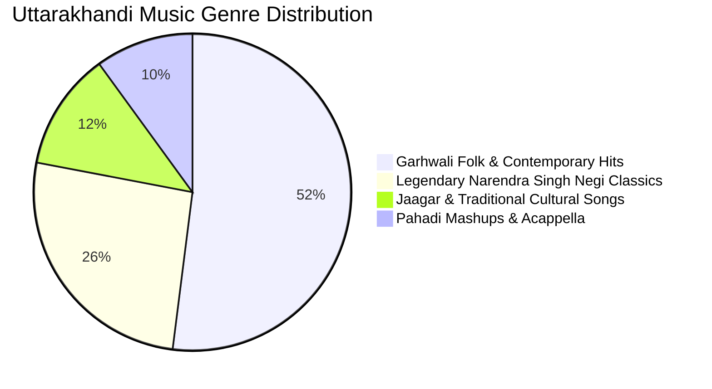
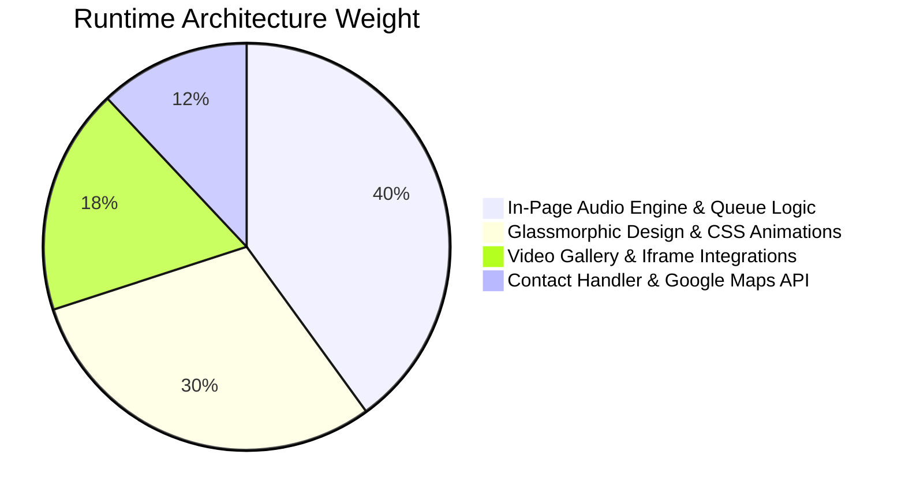
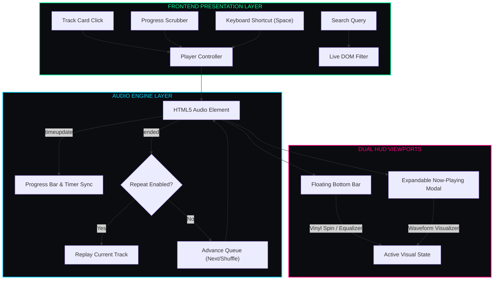

<div align="center">

<h1 style="font-family: 'Cooper Black', 'Arial Black', serif; font-size: 4rem; letter-spacing: 2px; color: #00ff99; margin-bottom: 2px; text-shadow: 0 0 25px rgba(0, 255, 153, 0.45);">
  🎵 SANGEET 🎵
</h1>

<h3 style="font-family: 'Bookman Old Style', 'URW Bookman', 'Georgia', serif; font-weight: 500; color: #00d4ff; margin-top: 6px; letter-spacing: 0.8px;">
  ◈ <i>"Your Melodious Companion"</i> ◈
</h3>

<br/>

[](#)
[](#)
[](#)
[](#)
[](#)
[](LICENSE)

<br/>

<p align="center" style="font-family: 'Bookman Old Style', 'URW Bookman', serif; font-size: 1.05rem;">
  <b>✦ <a href="#01-platform-overview">Overview</a> ✦</b> &nbsp;•&nbsp;
  <b>✦ <a href="#02-interface-hud-preview">Interface Preview</a> ✦</b> &nbsp;•&nbsp;
  <b>✦ <a href="#03-music-metrics--telemetry">Music Metrics</a> ✦</b> &nbsp;•&nbsp;
  <b>✦ <a href="#04-audio-engine--event-logic">Engine Logic</a> ✦</b> &nbsp;•&nbsp;
  <b>✦ <a href="#05-system-architecture">Architecture</a> ✦</b> &nbsp;•&nbsp;
  <b>✦ <a href="#06-directory-structure">Structure</a> ✦</b> &nbsp;•&nbsp;
  <b>✦ <a href="#07-quick-start">Quick Start</a> ✦</b> &nbsp;•&nbsp;
  <b>✦ <a href="#08-operational-workflows">Workflows</a> ✦</b>
</p>

---

</div>

<h2 id="01-platform-overview" style="font-family: 'Bookman Old Style', 'URW Bookman', 'Georgia', serif; color: #00ff99;">🌌 01. Platform Overview</h2>

<p style="font-family: 'Bookman Old Style', 'URW Bookman', serif; font-size: 1.05rem; line-height: 1.7;">
<b>Sangeet</b> is a high-performance, client-side web streaming application engineered to preserve, celebrate, and amplify the rich cultural soundscape of <b>Uttarakhand</b>. Built with a custom JavaScript audio engine and a dark glassmorphic interface, Sangeet delivers seamless in-page streaming for <b>35+ legendary Garhwali, Kumaoni, and Jaunsari tracks</b> by artists like <b>Narendra Singh Negi</b>, <b>Preetam Bhartwan</b>, <b>Inder Arya</b>, and <b>Pappu Karki</b> — alongside an integrated YouTube video gallery and contact portal.
</p>

```
  ┌─────────────────────────┐      ┌─────────────────────────┐      ┌─────────────────────────┐
  │  💿 Album Track Grid    │ ──❯  │ 🎛️ Stateful Audio Queue │ ──❯ │ 🎧 Glassmorphic Player  │
  │     (35+ Audio Cards)   │      │   HTML5 Audio Engine    │      │    Sticky Bar & Modal   │
  └─────────────────────────┘      └─────────────────────────┘      └─────────────────────────┘
```

> [!NOTE]
> **Zero Reload In-Page Audio**: Seamlessly play, pause, seek, shuffle, and loop tracks without page reloads, tab navigation, or external media players. The entire audio lifecycle is managed client-side via the HTML5 Audio API.

---

<h2 id="02-interface-hud-preview" style="font-family: 'Bookman Old Style', 'URW Bookman', 'Georgia', serif; color: #00ff99;">📸 02. Interface HUD Preview</h2>

<div align="center">

### ◈ 1. Home — Landing Gateway
<kbd>
  
</kbd>
<br/>
<sub style="font-family: 'Bookman Old Style', 'URW Bookman', serif;"><b>◈ Figure 1.0:</b> Central landing gateway featuring hero section, artist showcases, and navigation to all platform modules.</sub>

<br/><br/>

### ◈ 2. Music Player — Streaming Hub
<kbd>
  
</kbd>
<br/>
<sub style="font-family: 'Bookman Old Style', 'URW Bookman', serif;"><b>◈ Figure 1.1:</b> Interactive album card grid with persistent floating audio bar, vinyl spin animation, and real-time seek/volume controls.</sub>

<br/><br/>

### ◈ 3. Now Playing — Fullscreen Modal
<kbd>
  
</kbd>
<br/>
<sub style="font-family: 'Bookman Old Style', 'URW Bookman', serif;"><b>◈ Figure 1.2:</b> Expandable Now Playing modal with high-res vinyl artwork, animated waveform visualizer, and large playback controls.</sub>

<br/><br/>

### ◈ 4. Video Gallery — YouTube Showcase
<kbd>
  
</kbd>
<br/>
<sub style="font-family: 'Bookman Old Style', 'URW Bookman', serif;"><b>◈ Figure 1.3:</b> Responsive 3-column video gallery with 20+ embedded Uttarakhandi music videos, hover animations, and dark card elevations.</sub>

<br/><br/>

### ◈ 5. Contact Portal — Connect & Locate
<kbd>
  
</kbd>
<br/>
<sub style="font-family: 'Bookman Old Style', 'URW Bookman', serif;"><b>◈ Figure 1.4:</b> Functional contact form powered by FormSubmit with integrated Google Maps location embed and office details.</sub>

</div>

---

<h2 id="03-music-metrics--telemetry" style="font-family: 'Bookman Old Style', 'URW Bookman', 'Georgia', serif; color: #00ff99;">📊 03. Music Metrics & Telemetry</h2>

### 🥧 Track Genre & Style Distribution


### 🛰️ Frontend Subsystem Execution Profile


---

<h2 id="04-audio-engine--event-logic" style="font-family: 'Bookman Old Style', 'URW Bookman', 'Georgia', serif; color: #00ff99;">🔍 04. Audio Engine & Event Logic</h2>

<p style="font-family: 'Bookman Old Style', 'URW Bookman', serif; font-size: 1.02rem;">
The client-side audio engine processes lifecycle events and updates dual HUD viewports (bottom bar + fullscreen modal) in real time:
</p>

| User Action / Event | Audio Engine Execution | State Mutation | Visual HUD Representation |
| :--- | :--- | :---: | :--- |
| **Card Click** | `loadAndPlayTrack(index)` | `isPlaying = true` | Bottom player appears + vinyl rotates |
| **`timeupdate`** | `(currentTime / duration) * 100` | Real-time % progress | Seek slider fills + elapsed timer updates |
| **Seek Scrubber Drag** | `audio.currentTime = (val / 100) * duration` | Position updated | Immediate audio seek jump |
| **Track `ended`** | `playNextTrack()` or loop | `index = (index + 1) % len` | Auto-advances to next song seamlessly |
| **Spacebar Key** | `togglePlayPause()` | State inverted | Play/Pause icon toggles |
| **Volume Slider** | `audio.volume = val` | `volume: 0.0 -> 1.0` | Speaker icon reflects level (`off`/`down`/`up`) |
| **Shuffle Toggle** | Randomize queue index | `isShuffle = !isShuffle` | Shuffle icon highlights |
| **Repeat Toggle** | Loop current track | `isRepeat = !isRepeat` | Repeat icon highlights |

> [!TIP]
> **Autoplay Queue**: When a track finishes, the player automatically triggers the next song in the playlist queue. If `Shuffle` is active, a pseudo-random index is selected without repetition.

---

<h2 id="05-system-architecture" style="font-family: 'Bookman Old Style', 'URW Bookman', 'Georgia', serif; color: #00ff99;">🧬 05. System Architecture</h2>



---

<h2 id="06-directory-structure" style="font-family: 'Bookman Old Style', 'URW Bookman', 'Georgia', serif; color: #00ff99;">📂 06. Directory Structure</h2>

```
SANGEET - main/
├── LOGO/                    # Vector logos and brand graphics
│   ├── LOGO.png
│   └── LOGO 2.png
├── covers/                  # High-definition album covers & thumbnails
│   ├── 1750809799905.jpg
│   └── Cover of *.jpg
├── songs/                   # High-quality MP3 audio files
│   ├── Aejadi Bhagyani.mp3
│   ├── Chaitwali.mp3
│   └── ... (35+ tracks)
├── index.html               # Gateway & Home landing interface
├── style.css                # Home page styles & animations
├── music.html               # Interactive music streaming hub
├── music.css                # Glassmorphic player & modal stylesheets
├── video.html               # YouTube video gallery interface
├── video.css                # Video gallery grid & card styles
├── contact.html             # Contact portal & Google Maps integration
├── contact.css              # Contact form styles
└── README.md                # Platform documentation
```

---

<h2 id="07-quick-start" style="font-family: 'Bookman Old Style', 'URW Bookman', 'Georgia', serif; color: #00ff99;">🚀 07. Quick Start</h2>

### 📋 Prerequisites
- Any modern web browser (**Chrome**, **Edge**, **Firefox**, **Safari**)
- *(Optional)* VS Code **Live Server** extension for local development

### 🛠️ Clone & Launch

```bash
# 1. Clone the repository
git clone https://github.com/your-username/sangeet.git

# 2. Navigate to project root
cd sangeet

# 3. Launch with Live Server or open in browser
open index.html
```

### 🌐 Accessing Pages
- **Home**: `index.html`
- **Music Player**: `music.html`
- **Video Gallery**: `video.html`
- **Contact Us**: `contact.html`

---

<h2 id="08-operational-workflows" style="font-family: 'Bookman Old Style', 'URW Bookman', 'Georgia', serif; color: #00ff99;">🎮 08. Operational Workflows</h2>

### 🎧 Music Streaming Flow
1. **Navigate** to `music.html` and browse the album grid.
2. **Click** any album card — audio begins streaming instantly via the in-page player.
3. **Control** playback using the persistent floating bottom bar: Play/Pause, Next, Previous, Shuffle, Repeat.
4. **Seek** through the track by dragging the progress scrubber or adjust volume with the slider.
5. **Expand** the Now Playing modal by clicking the track info or the fullscreen button for an immersive vinyl experience.
6. **Search** tracks in real-time using the header search bar — results auto-filter and highlight.

### ⌨️ Keyboard Shortcuts
| Key | Action | Context |
| :---: | :--- | :--- |
| **`Space`** | Toggle Play / Pause | Global (when not in search field) |
| **`Escape`** | Close Now Playing Modal | When modal is open |
| **`Enter`** | Execute Search Query | When search bar is focused |

---

<h2 id="09-contact--services" style="font-family: 'Bookman Old Style', 'URW Bookman', 'Georgia', serif; color: #00ff99;">📞 09. Contact & Connect</h2>

<p style="font-family: 'Bookman Old Style', 'URW Bookman', serif; font-size: 1.02rem;">
The contact portal in <code>contact.html</code> is integrated with <b>FormSubmit</b> to forward submissions directly to your inbox without requiring backend servers.
</p>

- **Office Address:** Pundir Office, Bhagwan Singh Complex, 788, Gularghati Rd, Nathuwawala, Dehradun, Uttarakhand 248008.
- **Phone:** +91 9548014400
- **Email:** `priyanshupundir36@gmail.com`

---

<h2 id="10-license" style="font-family: 'Bookman Old Style', 'URW Bookman', 'Georgia', serif; color: #00ff99;">📜 10. License</h2>

Distributed under the **[MIT License](LICENSE)**.

<div align="center">

---

⭐ **Star this repository if you love Uttarakhandi & Pahadi Music!** ⭐

<p style="font-family: 'Bookman Old Style', 'URW Bookman', serif; color: #64748b; margin-top: 8px;">
  Crafted with ❤️ and passion by <b>Priyanshu Pundir</b> 🏔️🎶
</p>

</div>
